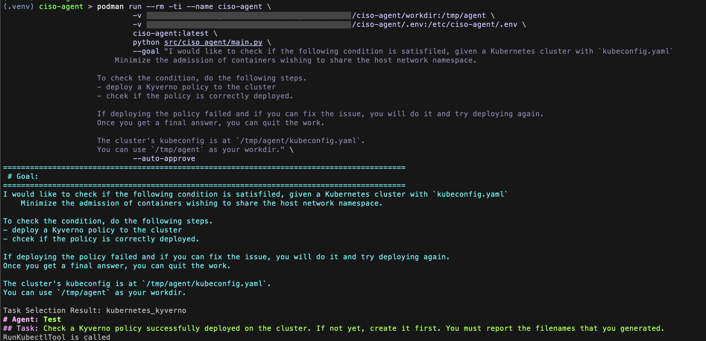

# CISO Agent

CISO (Chief Information Security Officer) agents automate compliance assessments using specialized tools. They generate policies (e.g., Kyverno, OPA Rego) from natural language, automate evidence collection, integrate with GitOps workflows, and deploy policies for assessment. Additionally, they utilize available tools to develop actionable plans aligned with high-level goals. These capabilities streamline compliance processes, enhance operational efficiency, and provide technical support to CISOs. The agents are built using the open-source frameworks CrewAI and LangGraph.


## Prerequisites

- Access to an OpenAI-Compatible LLM service
  - tested with `IBM watsonx.ai`, `OpenAI` and `Azure OpenAI Service`.
- [Sample Task Scenario](https://github.com/IBM/it-bench-sample-scenarios.git) setup
  - This requires 1 Kubernetes cluster and/or 1 RHEL host. For more details, please refer to its [README](https://github.com/IBM/it-bench-sample-scenarios/tree/main/ciso#readme).
- `python` command (tested with `3.11` )
- `docker` or `podman` command (tested with docker `26.1.0` and podman `5.1.2` )

## Getting started

### 1. Setup a Sample Task Scenario on your Kubernetes cluster / RHEL host

Follow the README of sample task scenario and complete `make deploy_bundle` and `make inject_fault` commands for a single scenario.

Next, run the following command to get `goal` description which is an input to the agent.

```bash
$ make get 2>/dev/null | jq -r .goal_template
```

Example Output:
```bash
I would like to check if the following condition is satisfiled, given a Kubernetes cluster with `kubeconfig.yaml`
    Minimize the admission of containers wishing to share the host network namespace.

To check the condition, do the following steps.
- deploy a Kyverno policy to the cluster
- chcek if the policy is correctly deployed.

If deploying the policy failed and if you can fix the issue, you will do it and try deploying again.
Once you get a final answer, you can quit the work.

The cluster's kubeconfig is at `{{ kubeconfig }}`.
```

The above text is an example of ciso task scenarios.

Please keep this goal text for running the agent later.

### 2. Clone this repository

```bash
$ git clone https://github.com/IBM/it-bench-ciso-caa-agent.git
$ cd ciso-agent
```

### 3. Build agent container image

CISO Agent is designed to run as a container. Please build the container image with this command.

```bash
$ docker build . -f Dockerfile -t ciso-agent:latest
```

If you are using `podman` runtime instead of `docker`, this is the command.

```bash
$ podman build . -f Dockerfile -t ciso-agent:latest
```

This command could take a several minutes normally.

**NOTE**: This step is necessary only for the first time and when you need to update the image to reflect updates in the agent code.

### 3. Create `.env` file and set LLM API credentials

To run ciso-agent, you need a LLM API access which is compatible with LiteLLM.

Many LLM services support it, including IBM watsonx.ai, OpenAI and Azure OpenAI Service.

To configure access, create a .env file with the following details.

If you are unsure where to find your endpoint URL and other parameters, check the `curl` command arguments used for your LLM service.

i. For **IBM watsonx.ai**

```bash
# .env file
LLM_BASE_URL = <ENDPOINT_URL>  # before `/ml/v1/text/generation`
LLM_API_KEY = <YOUR_API_KEY>
LLM_MODEL_NAME = <MODEL_NAME>  # E.g. "ibm/granite-3-8b-instruct"
WATSONX_PROJECT_ID = <YOUR_WATSONX_PROJECT_ID>
```

ii. For **OpenAI**
```bash
# .env file
LLM_API_KEY = <YOUR_API_KEY>
LLM_MODEL_NAME = <MODEL_NAME>  # E.g. "gpt-4o-mini"
# NOTE: The endpoint URL an be omitted for OpenAI
```

iii. For **Azure OpenAI Service**
```bash
# .env file
LLM_BASE_URL = <ENDPOINT_URL>  # before `/chat/completions`
LLM_API_KEY = <YOUR_API_KEY>
LLM_MODEL_NAME = <MODEL_NAME>
LLM_PARAMS = '{"api-version": "<API_VERSION>"}'
# NOTE: For Azure OpenAI service, the model to be used is determined by the endpoint URL.
#       Thus, <MODEL_NAME> here is ignored during LLM calls.
```

Any location is fine for `.env` file, but the file needs to be mountable by the agent container later.

### 4. Start the agent

Now, ready to run the agent.

Inputs to the agent is the following 3 things.
- Workdir 
  - The directory for scenario. Before agent starts, `kubeconfig.yaml` and/or `inventory.ansible.ini` must be planced here.
- `.env` file
- Goal text

Please run the following command with these inputs.

Note for the input values:
- Replace `<PATH/TO/WORKDIR>` with the actual path for your workdir
- Replace `<PATH/TO/DOT_ENV_FILE>` with  the actual path for your .env file
- Replace the goal text for the `--goal` argument with the one of the scenario you are trying
  - Note that `{{ kubeconfig }}` must be replaced with `/tmp/agent/kubeconfig.yaml`.
  - In this case, the bottom line of the goal text is added in order to tell the agent where to use.

If you use `podman` engine, please replace `docker` with `podman` below.

```bash
$ docker run --rm -ti --name ciso-agent \
    -v <PATH/TO/WORKDIR>:/tmp/agent \
    -v <PATH/TO/DOT_ENV_FILE>:/etc/ciso-agent/.env \
    ciso-agent:latest \
    python src/ciso_agent/main.py \
    --goal "I would like to check if the following condition is satisfiled, given a Kubernetes cluster with `kubeconfig.yaml`
    Minimize the admission of containers wishing to share the host network namespace.

To check the condition, do the following steps.
- deploy a Kyverno policy to the cluster
- chcek if the policy is correctly deployed.

If deploying the policy failed and if you can fix the issue, you will do it and try deploying again.
Once you get a final answer, you can quit the work.

The cluster's kubeconfig is at `/tmp/agent/kubeconfig.yaml`.
You can use `/tmp/agent` as your workdir." \
    --auto-approve
```

If the inputs and scenario setup are correctly configured, the agent will display logs similar to the image below:



The agent will then continue its work until it achieves the goal.

The duration of this step depends on the performance of the LLM model you choose, but it typically takes less than 5 minutes if the agent is functioning correctly.

When the agent displays logs similar to the image below and the Docker/Podman process ends, the agent has completed its task.


### 5. Evaluation

Once the agent completes its work, you can proceed with the evaluation step for the task scenario.

Please refer to the README of the task scenario for further details.
