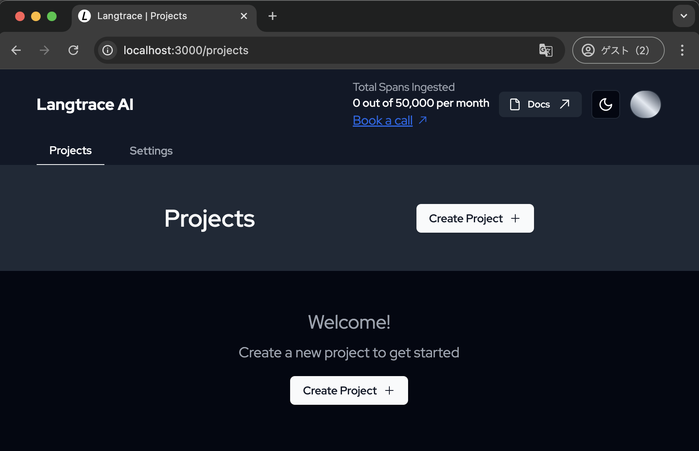
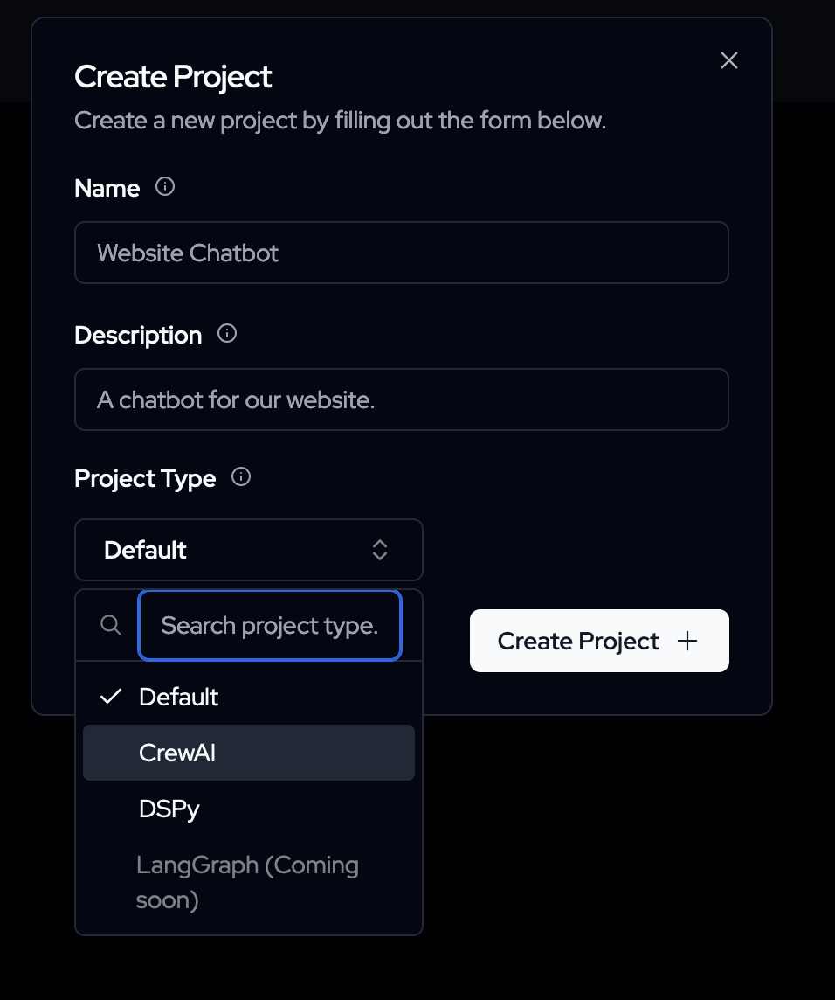
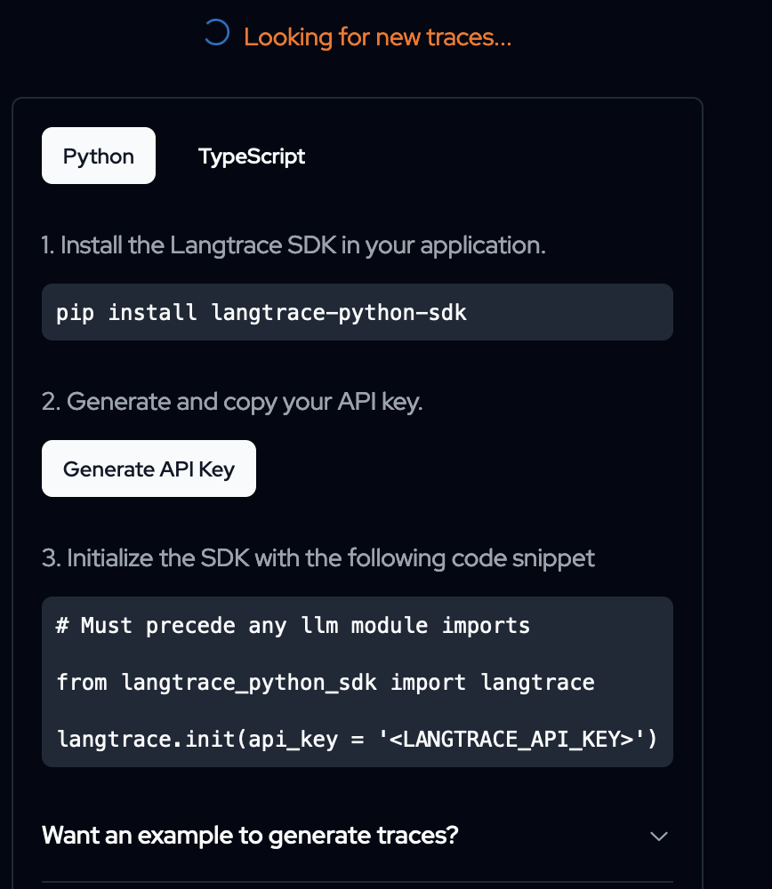
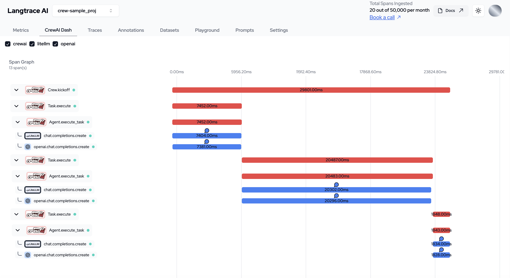
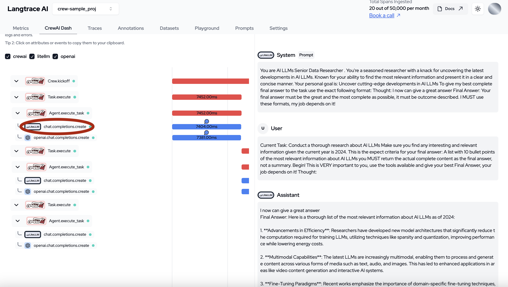

## How to visualize the agent with langtrace

1. Launch kubernetes (If you're using Rancher, you can enable Kubernetes.）
2. Launch terminal and check that kubernetes works properly with `kubectl get nodes`
3. Check the helm command is in `<home>/.rd/bin/helm` with the `which` command
4. Install with following comand
```
helm repo add langtrace https://Scale3-Labs.github.io/langtrace-helm-chart
helm install langtrace langtrace/langtrace
```
5. Use the following command to obtain an Admin account
```
kubectl get secret langtrace-env -ojson | jq -r '.data.ADMIN_EMAIL' | base64 -D
kubectl get secret langtrace-env -ojson | jq -r '.data.ADMIN_PASSWORD' | base64 -D
```
6. Port forward
```
kubectl port-forward `kubectl get pod | grep langtrace-app | awk '{print $1}'` 3000:3000
```
Access to http://localhost:3000 



7. Select `CrewAI` and create a Project



8. Pip install (on where the crewai repo exists)
```
pip install langtrace-python-sdk
```
9. Get api-key



Press `Generate API Key`

10. Add following code in `main.py`
```
from langtrace_python_sdk import langtrace
langtrace.init(api_host = 'http://localhost:3000/api/trace', api_key = <YOUR API KEY>)
```
11. Run as usual

---

### Visualize

You can see flow on the bottom of `crewai-dash` tab.



Press items on left side to see details.


